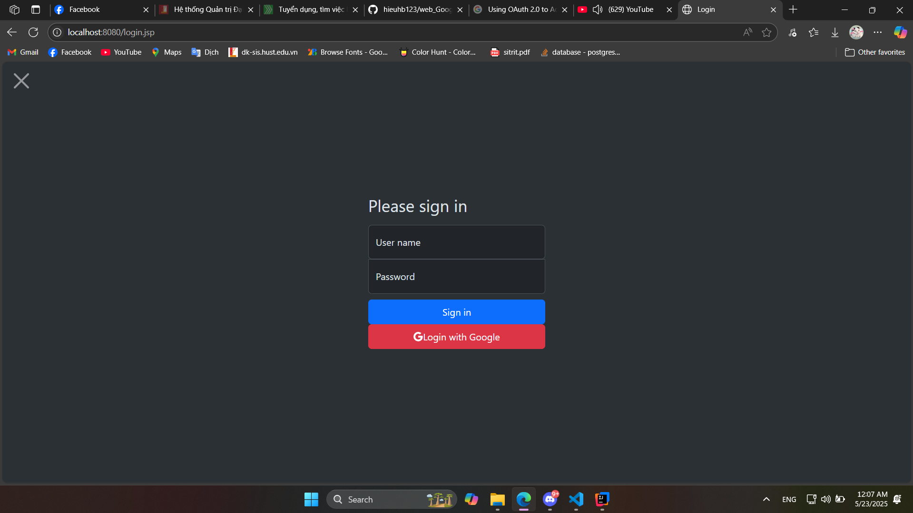
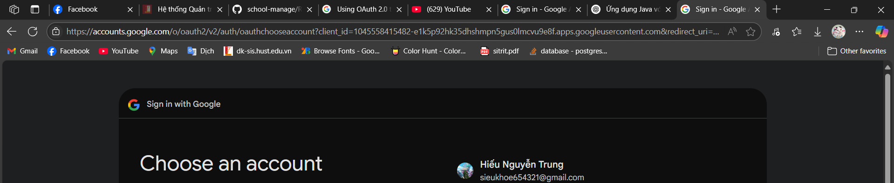
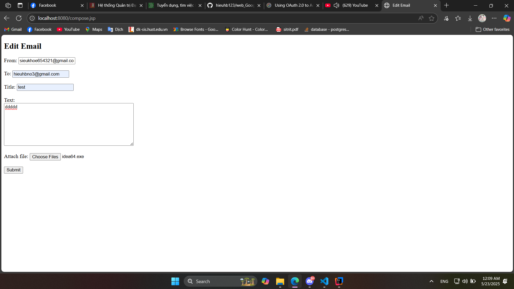
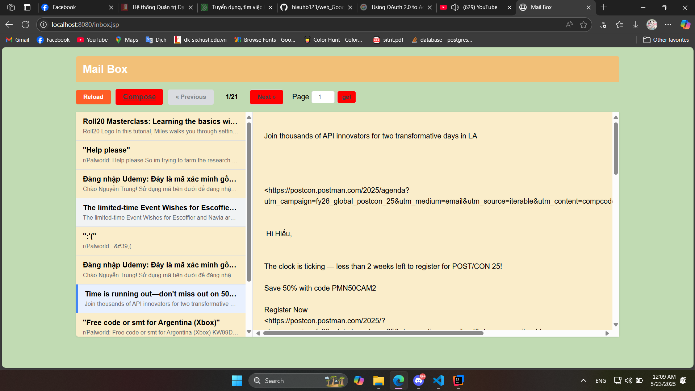

# 🌐 Java Web Application

This is a Java-based web application built with **IntelliJ IDEA**, deployed on **Apache Tomcat 11**, and integrated with **Google OAuth 2.0** for user authentication. It also features **Email API** integration for sending and verifying emails.

---

## Features

- Sign in with Google (OAuth 2.0)
- Send emails via Gmail API
- Read and display received emails
- Easy deployment on Tomcat 11
- IntelliJ IDEA development support

---

## Technologies

- Java 17+
- Apache Tomcat 11
- Servlet API
- Google OAuth 2.0
- JavaMail API or Gmail API
- IntelliJ IDEA
- Maven

---

## DEMO
#### Google OAuth Login

#### Read Inbox

#### Read Inbox

